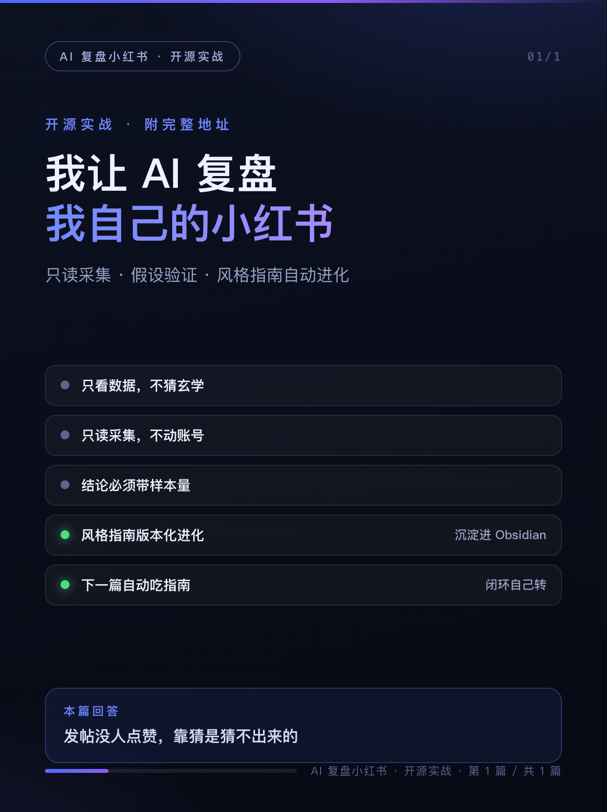
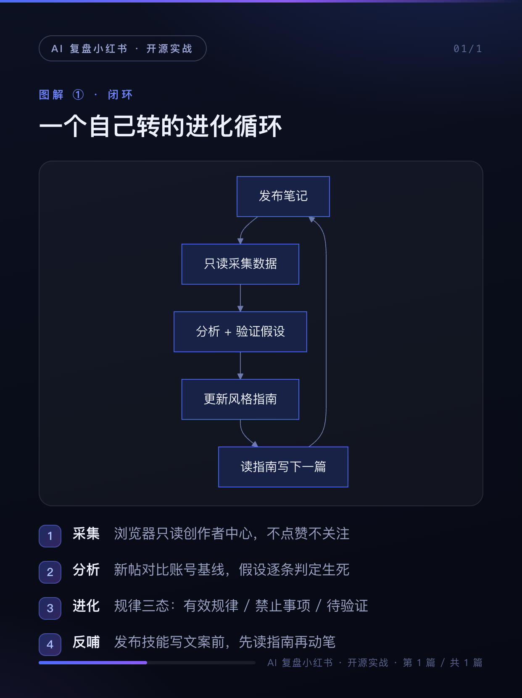

# xiaohongshu-analyst

**让 AI 复盘你自己的小红书账号：只读采集数据 → 分析规律 → 进化《风格指南》→ 沉淀 Obsidian —— 一个开箱即用的 AI Agent Skill**

*Self-analytics loop for your Xiaohongshu (RED) account: read-only data collection, evidence-based style-guide evolution, Obsidian knowledge sink — an open-source Agent Skill.*

[](LICENSE)
[](#-安装)
[](https://www.ego-browser.xyz/)
[](#-参与贡献)

---

发帖没人点赞，靠猜是猜不出来的。这个 skill 把「复盘」变成一个可持续运转的闭环：

```
只读采集(创作者平台) → 归档 snapshot → 对比上期分析 → 验证/证伪假设 → 进化《风格指南》→ 发布技能读指南写文案 → 产生新数据 → 下一期复盘
```

《风格指南》是唯一事实源：每条规律必须带数据证据，被证伪的规律移入「禁止事项」而不是删除，假设必须写明可证伪的判定条件——AI 对你账号的理解，随每一期复盘单调递增。

## 🖼 真实产出

| 封面 | 闭环图解 |
| --- | --- |
|  |  |

（以上卡片由姊妹项目 [xiaohongshu-publisher](https://github.com/mahingbun-dev/xiaohongshu-publisher) 的渲染管线产出，并已随本 skill 的首篇介绍帖发布到小红书。）

首次真实运行（2026-10-07）：只读采集一个 71 篇笔记的账号，最近 50 篇的 曝光/点赞/收藏/评论/分享/发布时间/封面 URL 字段 100% 填充，12 张封面图落盘，全程未产生任何互动行为。

| 采集字段 | 填充率 | | 采集字段 | 填充率 |
| --- | --- | --- | --- | --- |
| 标题 / 发布时间 | 50/50 | | 收藏 `collected_count` | 50/50 |
| 曝光 `view_count` | 50/50 | | 评论 `comments_count` | 50/50 |
| 点赞 `likes` | 50/50 | | 分享 `shared_count` | 50/50 |

## ✨ 特性

- **🕵️ 只读采集** — 复用浏览器登录态拦截创作者平台自身 XHR（接口带签名头，裸调 406），滚动触发应用翻页拿全量列表；不点赞、不收藏、不关注、不评论，两次采集间隔 ≥3 天防风控
- **📊 证据纪律** — 每条结论必须带样本量和指标对比（如「数字型标题 n=4，中位点赞 12 vs 账号 5」），无样本支撑的结论不允许写入指南
- **🔬 假设驱动** — 规律分三态：有效规律 `[E#]` / 禁止事项 `[X#]`（证伪不删除，保留学习轨迹）/ 待验证假设 `[H#]`（必须含可证伪的判定条件）；每期指南改动 ≤3 条，防止把单期噪声过拟合进规范
- **📚 Obsidian 沉淀** — snapshot JSON（原始事实源，写入后不改）、周期复盘报告、append-only 复盘日志，全部进你的 vault，形成可追溯的进化历史
- **🔗 发布闭环** — 产出直接被姊妹项目 [xiaohongshu-publisher](https://github.com/mahingbun-dev/xiaohongshu-publisher) 的文案阶段读取：指南 > 对标样本（自身数据优先）

## 📦 安装

前置要求：macOS + [Ego Lite](https://www.ego-browser.xyz/)（浏览器自动化，需在小红书创作者平台登录过一次）+ 任一支持 Agent Skills 的客户端（ZCode 等）。

```bash
git clone https://github.com/mahingbun-dev/xiaohongshu-analyst.git
cp -r xiaohongshu-analyst/analyst ~/.agents/skills/xiaohongshu-analyst
```

可选：安装 [Obsidian CLI](https://help.obsidian.md/cli) 用于复盘后即时查看笔记（非必需，vault 就是本地目录，直接读写文件）。

## 🚀 30 秒上手

对 Agent 说：

> 复盘一下小红书，最近发的几篇表现怎么样

首次运行会询问数据沉淀到哪个 Obsidian vault（写入技能目录的 `config.json`，之后不再询问），然后自动完成：采集 → 写入 `数据/YYYY-MM-DD-snapshot.json` → 输出评分表复盘报告 → 建立/更新《风格指南.md》→ 在复盘日志追加一条进化记录。

也支持只采集不分析（「看看小红书数据就行」）和只读指南（「我的标题该怎么写」）两种轻量模式。

## 🧠 工作原理

| 阶段 | 产物 | 纪律 |
| --- | --- | --- |
| 采集 | `数据/YYYY-MM-DD-snapshot.json` + 封面图 | 只读、≥3 天间隔、失败不连刷 |
| 分析 | `数据/YYYY-MM-DD-复盘.md`（评分表 + 假设处置） | 结论必须回溯到 snapshot 字段 |
| 进化 | `风格指南.md`（版本化）+ `复盘日志.md`（append-only） | 每期 ≤3 条改动、假设必须可证伪 |
| 反哺 | publisher 文案阶段读指南 | 指南与对标冲突时以指南优先 |

数据来源与已知限制：creator 登录即可拿全量 指标（曝光/赞/藏/评/享/封面）；笔记正文与主页公开数据需要 www 主站登录（未登录自动跳过，不阻塞）；小红书前端改版可能导致选择器漂移，`references/creator-recipe.md` 维护了手动配方与校准记录——技能自身也遵循「进化」。

## 🤝 参与贡献

欢迎 Issue / PR：新数据源、更多分析维度、Windows 支持（接管本机浏览器方案）都在 roadmap 上。

## License

[MIT](LICENSE)
